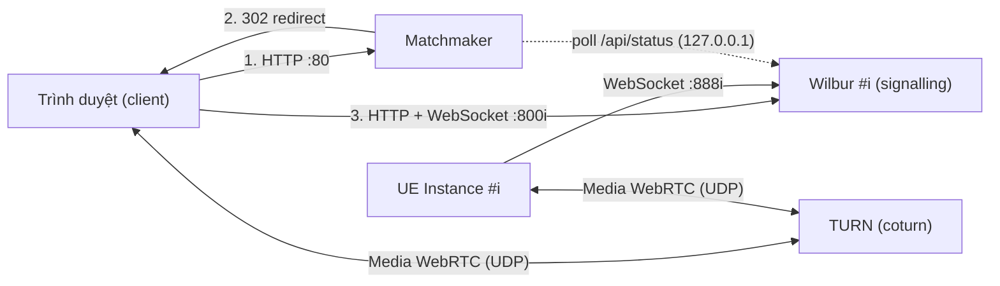

# Hướng dẫn triển khai Pixel Streaming (UE 5.7 + Matchmaker)

Tài liệu dành cho team: kiến trúc, cách chạy local, cách triển khai lên server riêng, cấu hình, port và xử lý sự cố.

> [!IMPORTANT]
> Stack này dùng **UE 5.7 + plugin Pixel Streaming 2**. Cirrus cũ (`SignallingWebServer/cirrus.js`, bản UE 5.0) **không tương thích**: UE 5.7 vẫn kết nối được nhưng không bao giờ gửi video.

---

## 1. Kiến trúc



| Thành phần | Vai trò | Nguồn |
|---|---|---|
| **Wilbur** | Signalling server + web server của UE5.7. **1 Wilbur phục vụ đúng 1 UE Instance** | Epic, [Infra-UE5.7/SignallingWebServer](../Infra-UE5.7/SignallingWebServer) (không sửa code) |
| **Frontend** | Trang `player.html` do Wilbur phục vụ | Epic, build từ `Infra-UE5.7/Frontend` |
| **Matchmaker** | Cửa vào duy nhất cho người dùng, chuyển mỗi người tới 1 instance còn trống | Tự viết: [matchmaker/matchmaker.js](matchmaker/matchmaker.js). Epic đã bỏ Matchmaker từ UE5.5 |
| **TURN** | Relay media khi UE và client không đi thẳng được với nhau | `coturn` trên server, `node-turn` khi test local |
| **UE Instance** | Bản build game, chạy với plugin Pixel Streaming 2 | Team build |

**Luồng một phiên:**
1. Người dùng mở `http://<server>/`.
2. Matchmaker chọn instance đang có UE kết nối và chưa có player, rồi redirect sang `http://<server>:800i/`. Instance đó được giữ chỗ 15 giây để 2 người không vào trùng.
3. Trình duyệt tải `player.html` và mở WebSocket tới Wilbur #i. Wilbur chuyển offer, answer và ICE giữa trình duyệt và UE.
4. Media WebRTC đi qua TURN (production) hoặc đi thẳng trên cùng máy (local).

Matchmaker biết trạng thái từng instance bằng cách gọi `GET http://127.0.0.1:800i/api/status` mỗi giây. Vì vậy **không cần port riêng giữa Matchmaker và Wilbur** (port 9999 của bản cũ đã bỏ).

---

## 2. Cấu trúc thư mục

```
PixelStreamingInfrastructure/
├── Infra-UE5.7/                 # Code Epic nhánh UE5.7, KHÔNG sửa. Nâng cấp = thay cả thư mục
│   ├── SignallingWebServer/     #   Wilbur (dist/index.js, www/player.html sau khi build)
│   ├── Signalling/, Common/     #   thư viện signalling
│   └── Frontend/                #   thư viện + trang player
├── Deployment/                  # Script và cấu hình của team
│   ├── stack.config.json        #   cấu hình chính (mục 5)
│   ├── Start-Stack.ps1          #   chạy TURN + Matchmaker + N x Wilbur
│   ├── Stop-Stack.ps1           #   dừng tất cả
│   ├── Status-Stack.ps1         #   xem trạng thái
│   ├── Start-UE.ps1             #   chạy các UE Instance với đúng port
│   ├── Open-Firewall.ps1        #   mở firewall Windows trên server (chỉ mode server)
│   ├── Common.ps1               #   hàm dùng chung
│   ├── matchmaker/              #   Matchmaker tự viết
│   ├── wilbur/bind-host.js      #   ép Wilbur listen 127.0.0.1 ở mode local
│   ├── node-turn/               #   TURN bằng Node (UDP), dùng khi test local
│   ├── tools/turn-test.html     #   trang tự test TURN relay
│   └── runtime/                 #   sinh ra khi chạy: config từng instance, log, PID (không commit)
├── SignallingWebServer/         # Cirrus cũ (UE5.0), KHÔNG còn dùng.
│                                #   Chỉ mượn script tải node/coturn trong platform_scripts/cmd
└── Matchmaker/                  # Matchmaker cũ, KHÔNG còn dùng
```

---

## 3. Yêu cầu

| Thứ | Yêu cầu |
|---|---|
| Hệ điều hành | Windows 10/11 hoặc Windows Server, PowerShell 5.1 hoặc 7 |
| Node.js | v22 trở lên (đã test v24.19). Nếu máy không có, script tự tải bản kèm theo |
| Mạng lúc cài | Truy cập được `registry.npmjs.org` (build lần đầu). Cần GitHub nếu muốn tự tải coturn |
| UE | **5.7**, bật **Pixel Streaming 2** và **tắt Pixel Streaming (v1)**. Bật cả 2 plugin sẽ có 2 streamer cùng kết nối |

---

## 4. Chạy thử trên máy local

Mode `local`: mọi thứ (UE, trình duyệt, TURN, Wilbur, Matchmaker) chạy trên một máy và chỉ listen `127.0.0.1`, máy khác không truy cập được. Không cần mở firewall.

```powershell
cd D:\Repo\PixelStreamingInfrastructure

# 1. Chạy stack. Lần đầu sẽ npm install + build Infra-UE5.7, mất khoảng 2-3 phút
.\Deployment\Start-Stack.ps1

# 2. Chạy UE (mỗi instance tự trỏ đúng port 8881, 8882, ...)
.\Deployment\Start-UE.ps1 -Exe "D:\Repo\Package\Windows\testces.exe" -Count 2

# 3. Kiểm tra: cột UE = 1, Players = 0 với mọi instance
.\Deployment\Status-Stack.ps1

# 4. Mở trình duyệt
start http://127.0.0.1/

# 5. Dừng tất cả (thêm -KeepUE để giữ UE chạy)
.\Deployment\Stop-Stack.ps1
```

Mỗi service chạy trong một cửa sổ console riêng (tiêu đề `Wilbur #1 ...`, `Matchmaker :80`, ...). Thêm `-Wait` vào `Start-Stack.ps1` để giữ terminal; khi bấm Ctrl+C cả stack sẽ dừng.

> [!NOTE]
> Ở mode local, script **không ép relay-only** dù `Turn.ForceRelay = true`. UE bỏ qua interface loopback nên không lấy được relay từ TURN `127.0.0.1`, còn relay bind ở `127.0.0.1` thì không gửi được tới địa chỉ LAN của UE, kết quả là màn hình đen. Vì vậy ở local, trình duyệt và UE đi thẳng với nhau trên cùng máy. **Đường relay-only chỉ kiểm tra được trên server thật.**

---

## 5. Cấu hình `stack.config.json`

```json
{
  "Mode": "local",
  "ServerIp": "auto",
  "PublicIp": "",
  "InstanceCount": 2,
  "Matchmaker": { "HttpPort": 80 },
  "Signalling": { "HttpPortBase": 8000, "StreamerPortBase": 8880, "SfuPortBase": 8980 },
  "Turn": {
    "Enabled": true, "Engine": "node-turn", "Port": 3478,
    "MinPort": 49152, "MaxPort": 65535, "Realm": "PixelStreaming",
    "User": "PixelStreamingUser", "Password": "AnotherTURNintheroad", "ForceRelay": true
  },
  "UE": { "Exe": "", "ExtraArgs": "-RenderOffScreen -ResX=1920 -ResY=1080 -ForceRes -AudioMixer", "LegacyArgs": false }
}
```

| Khoá | Ý nghĩa |
|---|---|
| `Mode` | `local`: mọi thứ bind `127.0.0.1`. `server`: bind mọi interface, dùng cho server riêng |
| `ServerIp` | IP mà máy UE dùng để kết nối tới server. `auto` = IP của card mạng có default route |
| `PublicIp` | IP hoặc domain mà client dùng (Matchmaker redirect về địa chỉ này). Để trống = giống `ServerIp`. Nếu server nằm sau NAT, đây là IP public |
| `InstanceCount` | Số Wilbur cần chạy, phải bằng số UE Instance |
| `Signalling.*PortBase` | Port của instance `i` = base + `i` (instance đầu tiên là `i = 1`) |
| `Turn.Engine` | `coturn` (server), `node-turn` (local, chỉ UDP), `auto` (thử coturn, lỗi thì dùng node-turn) |
| `Turn.MinPort/MaxPort` | Dải port UDP relay của TURN, phải khớp với rule firewall |
| `Turn.ForceRelay` | `true`: client chỉ dùng relay (`iceTransportPolicy: relay`). Chỉ áp dụng ở mode `server` |
| `UE.Exe`, `UE.ExtraArgs` | Giá trị mặc định cho `Start-UE.ps1` |
| `UE.LegacyArgs` | Chỉ dùng cho UE 4.27 (`-PixelStreamingIP/-PixelStreamingPort`) |

> [!WARNING]
> Đổi `Turn.User/Password` trước khi chạy production. File này đang chứa mật khẩu mặc định.

---

## 6. Bảng port

Ví dụ với cấu hình mặc định, instance `i = 1..N`:

| Port | Giao thức | Service | Ai kết nối tới | Mở ra ngoài? |
|---|---|---|---|---|
| **80** | TCP | Matchmaker | Client | Có |
| **8000+i** (8001, 8002, …) | TCP | Wilbur: web + WebSocket player + REST API | Client | Có |
| **8880+i** (8881, 8882, …) | TCP | Wilbur: WebSocket streamer | Máy UE | Có (chỉ từ dải IP của máy UE) |
| 8980+i | TCP | Wilbur: SFU | Không dùng | **Không** |
| **3478** | UDP (+TCP với coturn) | TURN listening | Client và máy UE | Có |
| **49152–65535** | UDP | TURN relay | Client và máy UE | Có (có thể thu hẹp, xem tài liệu IT) |

Máy UE **không cần mở port inbound nào**. Chỉ cần được phép kết nối ra server tới TCP `888x` và UDP `3478`, `49152–65535`.

---

## 7. Triển khai lên server riêng

1. **Copy repo** (gồm `Infra-UE5.7/` và `Deployment/`) lên server. Có thể copy luôn `node_modules`, `dist`, `www` đã build sẵn nếu server không vào được npm.
2. **Sửa `stack.config.json`:**
   ```json
   "Mode": "server",
   "ServerIp": "auto",            // hoặc IP nội bộ cụ thể, ví dụ "10.0.0.10"
   "PublicIp": "<IP/domain client dùng>",
   "InstanceCount": <số UE>,
   "Turn": { "Engine": "coturn", "ForceRelay": true, ... }   // nhớ đổi User/Password
   ```
3. **Chuẩn bị coturn:** script tự tải bằng `SignallingWebServer/platform_scripts/cmd/setup_coturn.bat` (cần GitHub). Nếu không tải được, copy `turnserver.exe` cùng các DLL vào `SignallingWebServer/platform_scripts/cmd/coturn/`.
4. **Mở firewall Windows** (PowerShell chạy bằng quyền Administrator):
   ```powershell
   .\Deployment\Open-Firewall.ps1 -MaxInstances 20
   ```
5. **Chạy stack:** `.\Deployment\Start-Stack.ps1`.
6. **Trên từng máy UE**, copy thư mục `Deployment/` rồi chạy:
   ```powershell
   # Máy UE #1 phục vụ instance 1-2
   .\Deployment\Start-UE.ps1 -Exe "D:\Builds\Game.exe" -ServerIp 10.0.0.10 -StartIndex 1 -Count 2
   # Máy UE #2 phục vụ instance 3-4
   .\Deployment\Start-UE.ps1 -Exe "D:\Builds\Game.exe" -ServerIp 10.0.0.10 -StartIndex 3 -Count 2
   ```
7. **Kiểm tra:** chạy `.\Deployment\Status-Stack.ps1` trên server, sau đó mở `http://<PublicIp>/` từ máy client.

> [!CAUTION]
> REST API của Wilbur (`/api/...`) đang nằm trên cùng port public với trang player (800x), để Matchmaker đọc được trạng thái. Trước khi đưa ra Internet, nên đặt reverse proxy (nginx/IIS) phía trước để chặn `/api/*` từ bên ngoài và bật HTTPS.

---

## 8. Lệnh chạy UE

Mỗi UE trỏ tới **Streamer port của Wilbur dành cho nó**, không trỏ tới Matchmaker:

```powershell
Game.exe -PixelStreamingConnectionURL=ws://<ServerIp>:8881 -RenderOffScreen -ResX=1920 -ResY=1080 -ForceRes -AudioMixer
Game.exe -PixelStreamingConnectionURL=ws://<ServerIp>:8882 -RenderOffScreen -ResX=1920 -ResY=1080 -ForceRes -AudioMixer
```

- UE 5.7 vẫn nhận `-PixelStreamingURL=...`, nhưng log cảnh báo là tham số cũ.
- **Không truyền tham số TURN cho UE.** Wilbur gửi cấu hình ICE/TURN cho UE khi kết nối.
- Mỗi port chỉ cho **một** UE. Hai UE cùng một port sẽ hiện 2 streamer trên cùng 1 instance (`Status-Stack.ps1` sẽ cảnh báo).
- Muốn thêm UE: tăng `InstanceCount`, khởi động lại stack, rồi chạy UE với port tiếp theo.

---

## 9. Matchmaker

| Endpoint | Kết quả |
|---|---|
| `GET /` | `302` sang instance trống. Nếu hết chỗ: trang chờ (`503`), tự thử lại mỗi 3 giây |
| `GET /signallingserver` | `{"signallingServer":"host:port"}` để client tự điều hướng |
| `GET /api/status` | Trạng thái từng instance: `free`, `in use`, `reserved`, `no UE`, `offline` |

- Query string được giữ khi redirect (ví dụ `/?AutoPlayVideo=true`).
- Log nằm ở `Deployment/runtime/matchmaker/logs/`.
- Instance chỉ được coi là **trống** khi có đúng UE kết nối (`streamer_count ≥ 1`) và `player_count = 0`.

---

## 10. Log và runtime

| Đường dẫn | Nội dung |
|---|---|
| `Deployment/runtime/wilbur_XX/logs/` | Log Wilbur (JSON, có mọi message signalling) |
| `Deployment/runtime/wilbur_XX/wilbur_XX.json` | Config sinh ra cho instance |
| `Deployment/runtime/wilbur_XX/peer_options.json` | Cấu hình ICE/TURN gửi cho UE và trình duyệt |
| `Deployment/runtime/matchmaker/` | Config và log của Matchmaker |
| `Deployment/runtime/turn/` | Config TURN |
| `<Game>/Saved/Logs/<Game>.log` | Log UE, tìm theo `LogPixelStreaming2` |

---

## 11. Xử lý sự cố

| Triệu chứng | Nguyên nhân | Cách xử lý |
|---|---|---|
| Log UE có `SignallingSession::OnMessage unknown message=[{"type":"playerConnected"...` | UE 5.7 đang nối vào Cirrus cũ | Dùng stack trong tài liệu này (Wilbur UE5.7) |
| Màn hình đen, góc dưới hiện **"WebRTC connection negotiated"** | Signalling xong nhưng ICE không có đường media | Local: kiểm tra `peer_options.json` **không** có `iceTransportPolicy: relay`. Server: kiểm tra TURN (`3478`, dải relay) và rule firewall |
| `Status-Stack` cột UE = 2, hoặc log cũ có `Dropping new streamer connection` | Hai UE cùng một port, hoặc bật cả Pixel Streaming v1 và v2 | Tắt bớt UE, mỗi UE một port, chỉ bật Pixel Streaming 2 |
| Cột HTTP = `DOWN` dù port vẫn listen; log Wilbur có `REST API initialization failed: ... apiDoc was invalid` | Wilbur không chạy từ thư mục của nó nên không tìm thấy `apidoc/` | Đã xử lý trong `Start-Stack.ps1` (`cd` vào `Infra-UE5.7/SignallingWebServer`). Nếu tự chạy tay, nhớ `cd` vào đó |
| `Start-Stack` treo ở `coturn not found, downloading...` | GitHub bị chặn hoặc chập chờn | Đặt `Turn.Engine` = `node-turn` (local), hoặc copy coturn thủ công (mục 7) |
| `These ports are already in use` | Stack cũ còn chạy hoặc app khác chiếm port | `Stop-Stack.ps1`, hoặc đổi `*PortBase` |
| Matchmaker luôn hiện trang chờ | Không instance nào có UE, hoặc đã có player | Xem `http://<server>/api/status` và `Status-Stack.ps1` |
| Muốn test riêng TURN | | Mở `Deployment/tools/turn-test.html`, kết quả mong đợi là `PASS` |

---

## 12. Nâng cấp phiên bản UE (5.8, ...)

1. Tải nhánh tương ứng: `https://github.com/EpicGamesExt/PixelStreamingInfrastructure/tree/UE5.8`.
2. Giải nén vào thư mục mới, ví dụ `Infra-UE5.8/`, rồi sửa `$script:InfraRoot` trong [Common.ps1](Common.ps1).
3. Xoá `Infra-UE5.8/SignallingWebServer/dist` nếu có, rồi chạy `Start-Stack.ps1`. Script sẽ tự `npm install` và build.
4. Kiểm tra lại các tham số CLI của Wilbur (`Infra-UE5.x/SignallingWebServer/src/index.ts`) và endpoint `/api/status`, vì Matchmaker phụ thuộc vào endpoint này.

Code Epic không bị sửa (việc giới hạn địa chỉ listen nằm trong `bind-host.js`), nên nâng cấp chủ yếu là thay thư mục.

---

## 13. Việc còn mở

- [ ] Test **relay-only** trên server thật, với UE ở máy riêng. Không test được ở local (xem mục 4).
- [ ] Cập nhật tài liệu xin port cho IT: bỏ port 9999, đổi tên Cirrus thành Wilbur.
- [ ] Thêm reverse proxy + HTTPS, chặn `/api/*` từ bên ngoài.
- [ ] Đổi thông tin đăng nhập TURN, cân nhắc dùng `--turn_secret` (credential có thời hạn) của Wilbur.
- [ ] (Sau này) Đóng gói Matchmaker và Wilbur bằng Docker/k8s. coturn chạy `hostNetwork`, UE vẫn chạy native trên máy có GPU.
