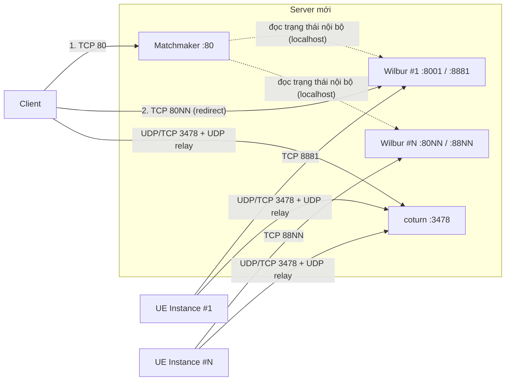

# Đề xuất mở port cho hệ thống Pixel Streaming (UE 5.7) – có Matchmaker

## 1. Mô tả hệ thống

Hệ thống stream ứng dụng 3D (Unreal Engine 5.7) lên trình duyệt bằng **WebRTC**. Có nhiều UE Instance chạy song song và mỗi người dùng được cấp riêng 1 instance. **Matchmaker** chia người dùng vào các instance đang rảnh. Máy UE và client **không kết nối trực tiếp được với nhau**, nên toàn bộ media được **relay qua TURN tự host**.

| Thành phần | Vị trí | Vai trò |
|---|---|---|
| **Máy UE Instance** (1 hoặc nhiều máy) | Máy GPU | Mỗi UE Instance render và stream cho 1 người dùng |
| **Server mới** (`<SERVER_IP>`) | Server xin mới | Chạy tất cả service bên dưới |
| ├ Matchmaker | Server mới | Điểm truy cập duy nhất của người dùng, chuyển người dùng tới instance đang rảnh |
| ├ Signalling Server (Wilbur) #1…#N | Server mới | Trao đổi thông tin kết nối giữa UE và trình duyệt, đồng thời phục vụ trang web player. **Mỗi UE Instance có 1 tiến trình Wilbur riêng** |
| └ coturn (TURN) | Server mới | Relay toàn bộ media giữa UE và Client |
| **Client** | Trình duyệt | Xem stream, gửi thao tác chuột/phím |

### Luồng kết nối
1. Mỗi **UE Instance** kết nối tới **Wilbur** của nó qua TCP `888x`.
2. **Matchmaker** đọc trạng thái của từng Wilbur ngay trên server (qua localhost), nên **không cần mở port nào giữa các service nội bộ**.
3. **Client** mở `http://<SERVER_IP>/`. Matchmaker chọn instance đang rảnh và **redirect** client sang `http://<SERVER_IP>:800x/`.
4. Client và UE trao đổi thông tin kết nối qua Wilbur, sau đó **media đi qua coturn**.

**UE và Client chỉ cần kết nối RA tới server mới.** Không cần mở port inbound nào trên máy UE hay máy Client.

---

## 2. Quy hoạch port (dự kiến tối đa 20 instance)

| Instance | Wilbur HTTP + WebSocket (client) | Wilbur Streamer (UE) | Wilbur SFU (không dùng, không mở) |
|---|---|---|---|
| #1 | 8001 | 8881 | 8981 |
| #2 | 8002 | 8882 | 8982 |
| … | … | … | … |
| #20 | 8020 | 8900 | 9000 |

| Service | Port | Ai truy cập |
|---|---|---|
| Matchmaker HTTP | 80 | Client |
| coturn | 3478 (UDP + TCP) + UDP 49152–65535 | UE + Client |

---

## 3. Danh sách rule cần mở

> Placeholder: `<UE_SUBNET>` là dải IP của các máy UE, `<CLIENT_SUBNET>` là dải IP của người dùng, `<SERVER_IP>` là IP của server mới.
> Firewall là stateful: chỉ cần mở chiều khởi tạo kết nối, chiều trả về tự được cho qua.

### Nhóm A – Matchmaker + Signalling (bắt buộc)

| # | Nguồn | Đích | Port | Giao thức | Mục đích |
|---|---|---|---|---|---|
| A1 | `<CLIENT_SUBNET>` | `<SERVER_IP>` | 80 | TCP | Matchmaker: điểm truy cập của người dùng |
| A2 | `<CLIENT_SUBNET>` | `<SERVER_IP>` | 8001–8020 | TCP | Web player và WebSocket signalling của từng instance (sau khi được redirect) |
| A3 | `<UE_SUBNET>` | `<SERVER_IP>` | 8881–8900 | TCP | Mỗi UE Instance kết nối tới Wilbur tương ứng (WebSocket) |

### Nhóm B – TURN (bắt buộc, toàn bộ media đi qua đây)

| # | Nguồn | Đích | Port | Giao thức | Mục đích |
|---|---|---|---|---|---|
| B1 | `<UE_SUBNET>` | `<SERVER_IP>` | 3478 | UDP + TCP | UE kết nối TURN |
| B2 | `<CLIENT_SUBNET>` | `<SERVER_IP>` | 3478 | UDP + TCP | Client kết nối TURN |
| B3 | `<UE_SUBNET>` | `<SERVER_IP>` | 49152–65535 | UDP | Relay port của TURN (cấp động cho từng phiên) |
| B4 | `<CLIENT_SUBNET>` | `<SERVER_IP>` | 49152–65535 | UDP | Relay port của TURN (cấp động cho từng phiên) |

### Nhóm C – Tuỳ chọn

| # | Nguồn | Đích | Port | Giao thức | Khi nào cần |
|---|---|---|---|---|---|
| C1 | `<CLIENT_SUBNET>` | `<SERVER_IP>` | 443 | TCP | HTTPS (reverse proxy) và/hoặc TURN qua TLS (`turns:`), cho client ở mạng chỉ cho đi ra cổng 443 |
| C2 | `<SERVER_IP>` | `<UE_SUBNET>` | 49152–65535 | UDP | **Chỉ xin nếu bước test trên server thất bại** (xem mục 5, ý cuối) |
| C3 | `<UE_SUBNET>` | `<SERVER_IP>` | (do dev quy định) | TCP | Nếu có tool tự khởi động lại UE từ xa |

### Firewall trên chính server (Windows Firewall hoặc iptables)
Inbound: TCP 80, 8001–8020, 8881–8900; UDP + TCP 3478; UDP 49152–65535.
**Không mở** 8981–9000 ra ngoài (chỉ dùng localhost). Dev có script tạo sẵn các rule này: `Deployment/Open-Firewall.ps1`.

---

## 4. Vì sao tự host TURN thay vì dùng dịch vụ bên ngoài

| Tiêu chí | **Tự host (coturn)** ✅ | Dịch vụ cloud (Twilio, Cloudflare, Xirsys, ...) |
|---|---|---|
| Độ trễ | Thấp, server nằm cùng mạng nội bộ | Cao hơn vì media phải ra Internet rồi quay về |
| Chi phí | Không tốn phí theo dung lượng | Tính theo GB: 1 stream khoảng **7 GB/giờ** |
| Bảo mật | Media không rời khỏi mạng công ty | Media đi qua bên thứ 3 |
| Phụ thuộc | Không cần Internet | Bắt buộc có Internet ổn định |

> `stun.l.google.com` của Google chỉ là **STUN**, không relay media. Google không cung cấp dịch vụ TURN công cộng.

---

## 5. Giải thích cho IT về các dải port

- **8001–8020 / 8881–8900:** mỗi UE Instance cần 1 tiến trình signalling riêng, và mỗi tiến trình dùng 1 cặp port riêng. 20 port tương ứng với tối đa 20 instance chạy đồng thời. Nếu cần mở rộng thì xin thêm theo cùng quy tắc: instance thứ `i` dùng `8000+i` và `8880+i`.
- **Không có port nội bộ giữa các service.** Matchmaker đọc trạng thái Wilbur qua localhost trên cùng server (port 9999 của phiên bản cũ đã bỏ).
- **UDP 49152–65535 (TURN relay):** theo chuẩn RFC 8656, TURN cấp cho mỗi phiên 1 relay port riêng. Port 3478 chỉ là port điều khiển dùng chung. Đây là dải ephemeral chuẩn của IANA và là dải mặc định của coturn và WebRTC. Port chỉ được dùng khi đang có phiên stream. Nếu cần thu hẹp, có thể giới hạn khoảng **4 port cho mỗi stream đồng thời** (ví dụ 49152–49351 cho 50 stream). Dev sẽ cấu hình coturn khớp với dải này.
- **Không dùng TCP thay cho UDP được.** Video thời gian thực trên TCP sẽ giật và trễ. TCP chỉ dùng làm đường dự phòng.
- **TURN có xác thực** bằng username/password, người ngoài không dùng ké server được.
- **Mọi rule chỉ áp dụng cho các subnet đã xác định**, không mở ra Internet (trừ khi client truy cập từ Internet, xem mục 6).
- **Về rule C2:** khi test, UE 5.7 vẫn gửi địa chỉ nội bộ của mình kèm theo địa chỉ relay. Bình thường kết nối sẽ đi relay ↔ relay qua TURN, chỉ cần nhóm A + B. Rule C2 chỉ là phương án dự phòng nếu thử trên server thật mà không lên hình. Dev sẽ báo lại sau khi test.

---

## 6. Mô hình đặt server theo vị trí của Client

| Client ở đâu | Cách đặt server |
|---|---|
| **Mạng nội bộ / VPN** | Server có 1 IP nội bộ, cả UE và Client đều truy cập được. |
| **Internet** | Server đặt ở **DMZ**, cần **IP public** (hoặc NAT 1:1 các port ở mục 3). UE truy cập server qua IP nội bộ, Client truy cập qua IP public. Nên mở thêm C1 (HTTPS 443) và đặt reverse proxy phía trước. |

---

## 7. Yêu cầu server

| Hạng mục | Giá trị |
|---|---|
| Băng thông mỗi stream (1080p60) | khoảng 10–20 Mbps vào + 10–20 Mbps ra (media đi qua TURN) |
| Card mạng **1 Gbps** | Chạy ổn khoảng **30–40 stream đồng thời** |
| CPU / RAM | 4–8 vCPU / 8–16 GB cho Matchmaker + 20 Wilbur + coturn |
| OS | Windows Server (script triển khai hiện tại viết bằng PowerShell) hoặc Linux |
| Phần mềm | Node.js 22+; coturn |
| Mạng lúc cài | Truy cập được `registry.npmjs.org` và `github.com` (tải coturn), hoặc dev mang sẵn bản build |

---

## 8. Cấu hình kỹ thuật đi kèm (phía dev)

Chi tiết triển khai xem [deployment_guide.md](deployment_guide.md). Tóm tắt các giá trị khớp với rule ở trên:

| Thành phần | Cấu hình (`Deployment/stack.config.json`) |
|---|---|
| Chung | `Mode: "server"`, `ServerIp: <SERVER_IP>`, `PublicIp: <IP client dùng>` |
| Matchmaker | `Matchmaker.HttpPort: 80` |
| Wilbur #i | `Signalling.HttpPortBase: 8000`, `StreamerPortBase: 8880`, `SfuPortBase: 8980` → port `8000+i`, `8880+i`, `8980+i` |
| coturn | `Turn.Engine: "coturn"`, `Port: 3478`, `MinPort/MaxPort` khớp với rule B3/B4, `ForceRelay: true`, đổi `User/Password` mặc định |
| UE Instance #i | `-PixelStreamingConnectionURL=ws://<SERVER_IP>:<8880+i>` (ví dụ #1 dùng `ws://<SERVER_IP>:8881`, #12 dùng `ws://<SERVER_IP>:8892`) |

> Matchmaker hiện redirect bằng `http://`. Nếu cần HTTPS thì dev đặt reverse proxy phía trước (cần rule C1).
